# ReframeAI

## One master asset. Infinite platform-ready versions. Zero manual cropping.

Every OTT platform and entertainment company faces the same expensive bottleneck: one high-quality master image or video must become dozens of platform-specific assets. A movie poster needs 1:1 for Instagram feed, 16:9 for YouTube thumbnails, 9:16 for TikTok and Instagram Reels, 4:5 for Instagram Stories. An episode clip needs a vertical reel for Shorts, square stills for promo, audio-inclusive cuts for autoplay feeds. And each output must carry the correct watermark, keep the talent in frame, meet exact dimension rules, and pass quality review — or content operations loses hours to manual crop-and-polish cycles.

ReframeAI eliminates that bottleneck. Feed in a master image or video and get back platform-ready variants — each subject-aware, watermark-preserved, quality-scored, and validated against a machine-readable spec. No GPUs. No model downloads. No manual review.

---

## What's in it for your team

| Your role | Before ReframeAI | After ReframeAI |
|---|---|---|
| **Content Operations** | Editors manually crop every asset for every platform, then QA each one against dimension/watermark/framing checklists | Upload masters; walk away. Validated assets are produced automatically in seconds |
| **Marketing / Distribution** | Posters, thumbnails, and clips vary in quality across platforms; brand assets (watermarks) sometimes get cropped out | Consistent, on-brand, on-spec outputs across every platform, every time |
| **Product Manager** | Media processing is a monolithic, fragile system — can't add a new platform format without an engineering sprint | Spec is YAML. New aspect ratio or dimension rule? Edit one file, redeploy |
| **Engineering Manager** | Heavy GPU-based pipelines (CUDA, transformers) with unpredictable costs and long runtimes | CPU-only, deterministic, bounded AI calls, 57 passing tests, Docker-ready |
| **ML/AI Engineer** | Black-box AI crops that can't be inspected or reproduced; no visibility into why a crop failed | Modular pipeline: AI recommends, deterministic CV executes, full debug artifacts for every output |
| **Finance** | GPU instances + heavy transformer inference = high cloud media processing bills | CPU-only inference with lightweight MediaPipe models. Gemini called at most twice per asset. |

---

## What it produces

**From one master image → four validated image variants**
16:9 (landscape), 1:1 (square), 9:16 (vertical), 4:5 (portrait). Each centers on the detected subject, preserves the watermark, and passes spec validation.

**From one master video → one speaker-aware reel + four stills + debug overlay**
- A 720×1280 vertical 9:16 reel (H.264 + AAC audio) that keeps the active speaker centered as they move and turn
- Four stills extracted at best-quality frames (1:1, 16:9, 9:16, 4:5)
- A debug overlay video showing face/person tracks, active-speaker labels, and crop rectangles frame-by-frame
- 8+ JSON debug artifacts (tracks, speaker timeline, crop trajectory, shot boundaries, validation result, AI review)

---

## Quick start

### Prerequisites

| Requirement | Why | Notes |
|---|---|---|
| Python 3.14 | Backend runtime | Pinned in `.python-version`. Use `uv` for package management |
| ffmpeg / ffprobe | Video/audio processing + spec validation | Must be on PATH |
| Node 20+ | Frontend UI only | Optional — backend works without it |
| Google Gemini API key | AI crop planning + visual review | Optional — pipeline runs fully deterministic without it |

No GPU, no CUDA, no model downloads. Everything runs on CPU with committed MediaPipe models (4 active, 21MB + 87MB bundled extras).

### 1. Clone, configure, install

```bash
git clone <repo-url>
cd reframe_ai
cp .env.example .env
# Edit .env and set GEMINI_API_KEY=your-key-here (optional but recommended)
uv sync --all-extras
source .venv/bin/activate
```

### 2. Run locally

```bash
# Backend (API + web UI backend)
uvicorn src.main:app --host 0.0.0.0 --port 5000

# Frontend (optional, separate terminal)
cd frontend && npm install && npm run dev
```

Open http://localhost:3000 for the web UI, or hit the API directly:

```bash
curl http://localhost:5000/health    # → {"status":"ok"}
```

### 3. Process media

```bash
# Image — all 4 platform variants
python scripts/run_image_mvp.py data/input_image.png

# Video — vertical reel + stills + debug overlay
python scripts/run_video_mvp.py data/input_video.mp4
```

### 4. Or deploy with Docker

```bash
cp .env.example .env
docker compose up --build
```

Backend on port 5000, frontend on port 3000. Volumes mount `./data`, `./output`, `./spec` so uploads and results persist.

### 5. Run tests

```bash
python -m pytest tests/ -v    # 57 tests, ~7s
```

---

## API reference

All endpoints are on the backend (`http://localhost:5000`).

| Method | Endpoint | Description |
|---|---|---|
| `GET` | `/health` | Health check → `{"status":"ok"}` |
| `POST` | `/process` | Unified upload: auto-detects image vs video, streams progress via SSE |
| `POST` | `/process-image` | Process an image into all 4 aspect variants |
| `POST` | `/process-image/variant/{ratio_name}` | Single variant (`16_9`, `1_1`, `9_16`, `4_5`) |
| `POST` | `/process-video` | Process a video into a 9:16 reel + 4 stills + debug overlay |

The `/process` endpoint accepts any image or video and streams real-time progress:

```
data: {"message": "Ingest: probing video metadata", "percent": 10}
data: {"message": "Perception: detecting faces and people", "percent": 35}
data: {"message": "Speaker: building active-speaker timeline", "percent": 55}
data: {"message": "Render: encoding 9:16 reel", "percent": 80}
data: {"complete": true, "summary": {...}, "type": "video"}
data: {"error": "..."}      // on failure
```

---

## How it works: the three-layer architecture

```
                    ┌──────────────────────────────────────┐
                    │  INPUT MEDIA (image or video)        │
                    └──────────┬───────────────────────────┘
                               │
              ┌────────────────┼────────────────┐
              │                │                │
              ▼                ▼                ▼
   ┌─────────────────┐ ┌────────────────┐ ┌────────────────┐
   │  AI LAYER        │ │  DETERMINISTIC  │ │  VALIDATOR      │
   │  (Gemini)        │ │  LAYER          │ │  (spec-driven)   │
   │                  │ │                 │ │                  │
   │ • Crop planning  │ │ • MediaPipe     │ │ • Dimensions     │
   │ • Visual review  │ │   (faces, people│ │ • Aspect ratio   │
   │ • Semantic       │ │   poses, tracks)│ │   (±2%)          │
   │   reasoning      │ │ • FFmpeg        │ │ • Subject        │
   │                  │ │   (ingest, audio│ │   framing         │
   │                  │ │   encode/decode)│ │ • Watermark      │
   │                  │ │ • numpy / PIL   │ │   presence       │
   │                  │ │ • Cropper (pure │ │ • Audio tracks   │
   │                  │ │   arithmetic)   │ │ • Metadata       │
   └─────────────────┘ └────────────────┘ └────────────────┘
              │                │                │
              │  ONCE per     │  per-frame /   │  per output
              │  pipeline     │  per ratio     │
              └────────────────┼────────────────┘
                               │
                               ▼
                    ┌──────────────────────────────────────┐
                    │  VALIDATED OUTPUT ASSETS              │
                    │  (image variants, video reel,          │
                    │   stills, debug overlay,              │
                    │   JSON manifests)                     │
                    └──────────────────────────────────────┘
```

**The design principle: AI plans, the machine executes.**

Gemini is invoked at most twice per pipeline run — once before rendering to recommend crop parameters, once after to critique the output. Between those two calls, every crop decision (every frame of every video, every variant of every image) is made by deterministic computer vision and pure arithmetic. This keeps the pipeline fast on CPU, fully reproducible, and with bounded AI spend.

Without a `GEMINI_API_KEY`, the pipeline runs fully deterministic — same CV detection, tracking, and validation; just with default crop parameters instead of AI-recommended ones.

**The spec is the contract.** `spec/platform_spec.yaml` defines every valid output format as YAML. The validator reads it at runtime. Adding a new platform format (say, 3:4 for a new social channel) means editing one YAML file — not touching Python.

---

## Chronological walkthrough: image pipeline

Orchestrated by `src/pipeline.py` → `process_image_to_variants`. Shared perception, then per-variant refine-and-retry:

```mermaid
flowchart TD
    USER["User uploads image PNG/JPG"] --> INGEST["Load source image<br/>src.image_crop.detect_subjects"]

    %% Stage 1: Perception (shared across all ratios)
    INGEST --> S1["STAGE 1: PERCEPTION<br/>MediaPipe BlazeFace detection<br/>detect_subjects() in src/image_crop.py<br/>→ tuple[list[Subject], str]<br/>model name returned alongside subjects"]

    %% Stages 2-6 happen per-ratio inside regenerate_crop
    S1 --> FOR["Begin per-ratio loop<br/>Ratios: 16_9 → 1_1 → 9_16 → 4_5<br/>src.pipeline.process_image_to_variants"]

    %% Regeneration loop (encapsulates stages 2-6 internally)
    FOR --> LOOP{"REGENERATION LOOP<br/>src.regeneration.regenerate_crop<br/>max_retries iterations"}

    LOOP --> S2["STAGE 2: AI PLANNING<br/>plan_crop_with_ai() in src/regeneration.py<br/>Gemini semantic analysis of image + subjects<br/>→ crop params dict"]
    S2 -->|"No GEMINI_API_KEY"| DET["Fallback: deterministic params<br/>target_coverage=0.5, min_margin=0.1"]
    DET --> S3
    S2 -->|"Key available"| GEM["Gemini recommends<br/>coverage, margin, center_x, center_y"]
    GEM --> S3

    %% Stage 3: Crop Planning
    S3["STAGE 3: CROP PLANNING<br/>plan_crop() in src/image_crop.py<br/>Deterministic arithmetic from subjects + AI params<br/>→ CropPlan"] --> S4

    %% Stage 4: Rendering
    S4["STAGE 4: RENDERING<br/>render_crop() in src/image_crop.py<br/>PIL/numpy slice of crop rectangle<br/>→ np.ndarray rendered variant"] --> S5

    %% Stage 5: Validation
    S5["STAGE 5: VALIDATION<br/>validate_asset() in src/validator.py<br/>• Dimensions check (min/max)<br/>• Aspect ratio ±2%<br/>• Subject framing (edge cutoffs)<br/>• Watermark overlap<br/>→ ValidationResult"] --> S6

    %% Stage 6: AI Evaluation (optional)
    S6["STAGE 6: AI EVALUATION<br/>evaluate_crop_with_ai() in src/regeneration.py<br/>Gemini critiques rendered crop for framing quality<br/>→ AIEvaluationResult"] --> DEC

    %% Decision
    DEC{"Decision"}
    DEC -->|"Both pass"| PASS["PASS<br/>RegenerationResult returned"]
    DEC -->|"Either fails"| FAIL["FAIL<br/>Construct structured feedback<br/>Use AI adjustment params<br/>→ Re-plan with adjusted params"]
    FAIL --> LOOP

    %% Post-regeneration
    PASS --> SAVE["Save outputs:<br/>• output/image_variants/{stem}_{ratio}.png<br/>• output/manifests/{stem}_{ratio}.json"]
    SAVE --> NEXT{"More ratios?"}
    NEXT -->|"Yes"| LOOP
    NEXT -->|"No: all 4 done"| OUT

    OUT["OUTPUT<br/>• 4 variant PNGs (one per aspect ratio)<br/>• 4 manifest JSONs<br/>• validation JSONs"]
```



### Stage 1 — Perception: `src/image_crop.py` → `detect_subjects()`

MediaPipe BlazeFace scans the source image for faces. If the model file is missing, returns an empty list (not an error) and falls back to center crop. Each face becomes a `Subject` dataclass (bounding box, importance, category).

### Stage 2 — AI planning: `src/regeneration.py` → `plan_crop_with_ai()`

If Gemini is available, it receives the image + subject bounding boxes and returns crop parameters: target coverage, margin, and optionally an explicit center point. A description cache (`_description_cache`) avoids re-describing the same image for each of the four variants. Without a key: deterministic defaults (coverage 0.5, margin 0.1).

### Stage 3 — Crop computation: `src/cropper.py` → `compute_crop()`

Pure arithmetic — no ML. Given source dimensions, subjects, and target ratio:
1. Computes the weighted union bounding box of all subjects.
2. Derives crop dimensions so subjects occupy the target coverage percentage.
3. Centers on the importance-weighted centroid (or Gemini-recommended center).
4. Clamps to image boundaries.
5. Computes quality metrics: coverage percentage, per-edge cutoff fractions.

`compute_all_image_crops()` runs this for all four ratios at once.

### Stage 4 — Rendering: `src/image_crop.py` → `render_crop()`

PIL/numpy slices the crop rectangle from the source array at full resolution. Pixel-accurate, no resizing.

### Stage 5 — Validation: `src/validator.py` → `validate_asset()`

Reads `spec/platform_spec.yaml` and checks:
- **Dimensions** — output meets min/max bounds per ratio (e.g., 16:9 needs ≥1080×608)
- **Aspect ratio** — within ±2% of target
- **Subject framing** — no edge cutoff exceeds `max_edge_cutoff_pct` (20-25% depending on ratio)
- **Watermark** — required text appears in the output
- **Metadata** — JSON manifest has all `required_fields` populated

With `verify_files=True`, opens the actual output PNG via PIL to confirm real on-disk dimensions.

### Stage 6 — AI evaluation: `src/regeneration.py` → `evaluate_crop_with_ai()`

Gemini critiques the rendered crop for framing quality. If validation or AI review fails, structured feedback (e.g., "subject cut off 30% on left, increase margin") drives a re-plan with adjusted parameters. Up to 3 retries per variant.

### Stage 7 — Manifest: `src/regeneration.py` → `build_manifest()`

JSON manifest written to `output/manifests/` with all spec-required fields: asset type, name, input hash, input/output paths, dimensions, crop params, validation status, processing time, timestamp.

---

## Chronological walkthrough: video pipeline

Orchestrated by `src/video_pipeline.py` → `process_video_to_reel`. 8 stages with a render+review feedback loop:

```mermaid
flowchart TD
    USER["User uploads video MP4/MOV/AVI"] --> S1

    %% Stage 1: Ingest
    S1["STAGE 1: INGEST<br/>extract_video_metadata() in src/video_ingestion.py<br/>ffprobe → VideoMetadata<br/>(duration, fps, codec, audio tracks, total frames)"] --> S2

    %% Stage 2: Perception
    S2["STAGE 2: PERCEPTION<br/>VideoPerceiver in src/video_perception.py<br/>• Sample frames, max_dim=640<br/>• Face detection (BlazeFace, reused detector)<br/>• Person detection (EfficientDet-Lite0, full-body bboxes)<br/>• SimpleTracker: tracks persons (primary), associates faces (by containment)<br/>• Shot boundary detection<br/>→ list[TrackedPerson]<br/>[all bboxes scaled back to source resolution]"] --> S3

    %% Stage 3: Audio
    S3["STAGE 3: AUDIO<br/>detect_speech_activity() in src/video_audio.py<br/>ffmpeg audio extract → mono 16kHz PCM<br/>RMS energy @ 50ms windows → speech mask<br/>→ SpeechActivity"] --> S4

    %% Stage 4: Landmarks (MAR)
    S4["STAGE 4: LANDMARKS (MAR)<br/>VideoPerceiver.compute_mars() in src/video_perception.py<br/>• Sample frames @ 2fps<br/>• Face landmarker → MAR (Mouth Aspect Ratio)<br/>• Associate MAR to tracks by centroid proximity<br/>→ dict[track_id, list[(timestamp, mar)]]"] --> S5

    %% Stage 5: Active Speaker
    S5["STAGE 5: ACTIVE SPEAKER<br/>infer_active_speaker_timeline() in src/video_speaker.py<br/>Fuse: audio speech + visual MAR<br/>• Highest MAR face during speech = speaker<br/>• Temporal smoothing: hold 0.3s minimum<br/>• Merge adjacent same-speaker segments<br/>→ list[ActiveSpeakerSegment]"] --> S6

    %% Stage 6: Best Segment Finding
    S6["STAGE 6: BEST SEGMENT FINDING<br/>find_best_segment() in src/video_segment.py<br/>If video > VIDEO_SEGMENT_DURATION_SEC (30s):<br/>• Sliding window scored by weighted sum:<br/>  - Motion density (weight=0.30)<br/>  - Face activity (weight=0.25)<br/>  - Audio energy (weight=0.25)<br/>  - Shot changes (weight=0.20)<br/>If ≤30s: use entire video<br/>→ BestSegment (start, end, score)"] --> S7

    %% Stage 7: Render + Review Feedback Loop
    S7{"RENDER + REVIEW LOOP<br/>src/video_pipeline.py<br/>up to VIDEO_SEGMENT_MAX_RETRIES=3 iterations"}

    %% 7a: Gemini Crop Planning
    GP["Gemini Pre-Render Crop Planning<br/>gemini_plan_crop() in src/video_review.py<br/>• Select keyframes (shot boundaries + speaker transitions)<br/>• Run face (red) + person (yellow) + pose (green) detection on each<br/>• Composite grid with proposed crop overlay (cyan)<br/>• ONE Gemini call → center + coverage + scene_adjustments<br/>• If unavailable: deterministic fallback (speaker centroid)<br/>scene_adjustments maps shot boundary timestamps → recommended centers"] --> TRAJ
    GP --> TRAJ

    %% 7b: Build Trajectory
    TRAJ["Build Crop Trajectory<br/>build_crop_trajectory() in src/video_speaker.py<br/>• For each frame: find active speaker → predict interpolated bbox<br/>  (prefers person bboxes ~5-10x larger than face bboxes; fallback to face)<br/>• Adaptive padding: person bbox → pad_x=0.15, pad_y_top=0.25;<br/>  face bbox → pad_x=0.5, pad_y_top=0.5, pad_y_bottom=0.5<br/>• compute_crop() with Gemini-recommended coverage (default 0.30)<br/>• EMA smooth center (alpha=0.2); SNAP to Gemini scene_adjustments at shot boundaries<br/>• Min crop height = 35% source (prevents excessive zoom)<br/>• Trajectory built for FULL video, then sliced to segment<br/>→ list[CropTrajectoryPoint]"] --> SLICE

    SLICE["Slice trajectory + tracks to segment<br/>start_frame:end_frame+1<br/>tracks filtered to segment bboxes"] --> RENDER

    %% 7c: Render
    RENDER["STAGE 7c: RENDER<br/>render_vertical_video() in src/video_rendering.py<br/>FFmpeg pipe: decode → Python crop → ffmpeg encode<br/>• Resize to 720×1280 (9:16)<br/>• libx264 CPU encode (superfast, CRF 28)<br/>• Audio mux (copy AAC)<br/>• Best-frame still extraction @ 4 ratios (1:1, 16:9, 9:16, 4:5)<br/>• Debug overlay (track bboxes + speaker label + crop rect)<br/>→ RenderResult (reel + stills + debug)"] --> QUAL

    %% 7d: Segment Quality
    QUAL["Segment Quality Evaluation<br/>evaluate_segment_quality() in src/video_review.py<br/>Deterministic metrics:<br/>• Face coverage (speaker face in crop)<br/>• Audio coverage (speech fraction)<br/>• Shot retention<br/>• Speaker diversity<br/>• Trajectory validity<br/>→ SegmentQuality"] --> REVIEW

    %% 7e: Gemini Review
    REVIEW["STAGE 7e: AI VISUAL REVIEW<br/>gemini_review_video() in src/video_review.py<br/>• Select 8-12 representative frames (shot boundaries + speaker transitions)<br/>• Composite grid: original 16:9 + rendered 9:16 side by side<br/>• ONE Gemini call with full trajectory + speaker metadata<br/>→ VideoReviewResult (score, errors, suggestions)"] --> CHECK

    %% Decision
    CHECK{"Both quality + review pass?"}
    CHECK -->|"Yes"| EXIT_LOOP["Exit loop with best result"]
    CHECK -->|"No"| ADJUST["Retry: shift segment boundaries (±3s)<br/>Widen target_coverage (loosen crop)<br/>Feed previous review errors to gemini_plan_crop"]
    ADJUST --> GP

    %% Post-loop
    EXIT_LOOP --> S8["STAGE 8: VALIDATION<br/>validate_asset() in src/validator.py<br/>• min 720×1280 for reel<br/>• audio_required = true (ffprobe check)<br/>• aspect ratio 9:16 (±2%)<br/>• Required metadata fields populated<br/>→ ValidationResult"]

    S8 --> SAVE["Save outputs:<br/>• output/video_reels/{stem}_9_16.mp4<br/>• output/video_reels/{stem}_debug.mp4<br/>• output/stills/{stem}_{1_1|16_9|9_16|4_5}.jpg<br/>• output/manifests/{stem}_*.json (8 debug artifacts)"]

    SAVE --> OUT["OUTPUT<br/>• Vertical 9:16 reel with audio<br/>• Debug overlay video<br/>• 4 still images (1:1, 16:9, 9:16, 4:5)<br/>• 8+ JSON debug artifacts<br/>  (metadata, tracks, speaker timeline,<br/>  crop trajectory, validation, shots,<br/>  speech activity, AI review)"]
```



### Stage 1 — Ingest: `src/video_ingestion.py` → `extract_video_metadata()`

ffprobe extracts duration, FPS, codec, audio tracks, total frames → `VideoMetadata` dataclass.

### Stage 2 — Perception: `src/video_perception.py` → `VideoPerceiver`

The heaviest stage. `VideoPerceiver` creates four MediaPipe models **once** and reuses them across all frames (0.02s/frame vs 0.4s/frame for per-frame construction):
- **BlazeFace** — face detection
- **EfficientDet-Lite0** — person detection (full-body bboxes)
- **Face landmarker** — facial landmarks
- **Pose landmarker** — pose estimation

Frames sampled at 4.0 fps, downscaled to 640×480 for speed. Bounding boxes scaled back to source resolution (e.g., 1920×1080) — without this, crop coordinates are off by ~3x. `SimpleTracker` (IOU + centroid) tracks people; face bboxes associated to tracks by containment. Shot boundaries detected via frame-difference analysis.

> **Why person tracking, not face tracking?** Full-body person boxes are ~5-10x larger than face boxes, making IOU matching far more stable. Faces still drive MAR-based speaking detection.

### Stage 3 — Audio: `src/video_audio.py` → `detect_speech_activity()`

FFmpeg extracts mono 16kHz PCM. RMS energy over 50ms windows → binary speech mask. No scipy, no librosa, no torchaudio — just numpy + ffmpeg. Returns `SpeechActivity` dataclass.

### Stage 4 — Landmarks (MAR): `src/video_perception.py` → `VideoPerceiver.compute_mars()`

At 2.0 fps, face landmarker extracts mouth landmarks. Mouth Aspect Ratio (MAR) computed per tracked face, associated to tracks by centroid proximity. MAR spikes when someone talks — the visual half of speaker detection.

### Stage 5 — Active speaker: `src/video_speaker.py` → `infer_active_speaker_timeline()`

Fuses audio speech activity + visual MAR. During a speech burst, the face with the highest MAR on the largest track is the active speaker. 0.3s temporal smoothing prevents flicker. Adjacent same-speaker segments merge. → `list[ActiveSpeakerSegment]`.

### Stage 6 — Best segment: `src/video_segment.py` → `find_best_segment()`

For videos over 30s, a sliding window scores every possible 30s segment by weighted combination:
- Motion density (30%) + Face activity (25%) + Audio energy (25%) + Shot changes (20%)

Highest-scoring window wins. Videos ≤30s use the entire clip.

### Stage 7 — Render + review loop (up to 3 iterations)

#### 7a. Gemini crop planning: `src/video_review.py` → `gemini_plan_crop()`

A **single** Gemini call receives a composite grid of representative keyframes (shot boundaries + speaker transitions), each overlaid with face bboxes (red), person bboxes (yellow), pose landmarks (green), proposed crop (cyan). Returns crop center, coverage, and scene-adjustment anchors. Without a key: deterministic fallback using speaker centroid.

#### 7b. Crop trajectory: `src/video_speaker.py` → `build_crop_trajectory()`

For every frame in the segment (`src/cropper.compute_crop` reused):
1. Finds the active speaker for the frame.
2. Predicts their interpolated bounding box.
3. Adaptive padding — person bboxes get light padding (shoulders already included); face-only bboxes get heavy padding.
4. `compute_crop` with Gemini-recommended coverage (default 0.30).
5. EMA-smoothed center (alpha=0.2) for fluid motion.
6. Snaps to Gemini-recommended center at shot boundaries.
7. Enforces minimum crop height of 35% of source (prevents excessive zoom).

Trajectory built for full video, then sliced to segment window.

#### 7c. Rendering: `src/video_rendering.py` → `render_vertical_video()`

FFmpeg pipe-decode → Python crops each frame dynamically → FFmpeg encode. Reel at 720×1280 (9:16), H.264, CRF 28, with AAC audio muxed in. Four stills extracted (1:1, 16:9, 9:16, 4:5). Debug overlay shows tracks, speaker labels, crop rectangles.

#### 7d. Segment quality: `src/video_review.py` → `evaluate_segment_quality()`

Deterministic metrics: face coverage, audio coverage, shot retention, speaker diversity, trajectory validity.

#### 7e. Gemini review: `src/video_review.py` → `gemini_review_video()`

**Single** Gemini call on a composite grid (original 16:9 + rendered 9:16 side by side) with full trajectory + speaker metadata. Returns quality score, errors, suggestions.

#### Decision

Both quality + review pass → exit loop. If either fails → shift segment boundaries ±3s, widen coverage, feed review errors to `gemini_plan_crop`, retry (up to 3 attempts).

### Stage 8 — Validation: `src/validator.py` → `validate_asset()`

Checks the reel against `asset_types.video_reel`:
- Dimensions: 720×1280 minimum, 1080×1920 maximum
- Aspect ratio: 9:16 (±2%)
- Audio: at least one AAC track (ffprobe on output file)
- Metadata: `crop_trajectory`, `speaker_ids`, `scene_boundaries`, `keyframe_crops` populated

---

## Project structure

```
reframe_ai/
  src/                      # Python backend (FastAPI + pipelines)
    config.py               # Central config: paths, constants, API key helpers
    cropper.py              # Pure-arithmetic subject-aware crop computation
    image_crop.py           # MediaPipe detection + crop planning + rendering
    pipeline.py             # Image pipeline orchestrator
    regeneration.py         # AI-assisted generate→validate→feedback→retry loop
    validator.py            # Spec-driven output validation
    video_pipeline.py       # Video pipeline orchestrator
    video_ingestion.py      # ffprobe metadata extraction
    video_perception.py     # MediaPipe detection + tracking + shot boundaries
    video_audio.py          # Speech activity detection (RMS energy)
    video_speaker.py        # Active speaker inference + crop trajectory
    video_segment.py        # Best 30s segment finding
    video_rendering.py      # FFmpeg render: reel + stills + debug
    video_review.py         # Gemini planning + quality + review
    main.py                 # FastAPI app + REST + SSE endpoints
    api/                    # API route modules
  spec/
    platform_spec.yaml      # Machine-readable output contract (source of truth)
  frontend/                 # Next.js 15 + Tailwind web UI
    app/
  models/                   # MediaPipe models (108MB total, 4 used — committed)
  data/                     # Input assets (gitignored, local-only)
  output/                   # Generated outputs (gitignored)
    image_variants/         # Cropped images
    video_reels/            # Rendered reels + debug overlays
    stills/                 # Extracted stills (4 ratios)
    manifests/              # JSON manifests + debug artifacts
    uploads/                # Uploaded input files (UUID-named subdirs)
  scripts/                  # CLI runners + demos
    run_image_mvp.py        # End-to-end image pipeline
    run_video_mvp.py        # End-to-end video pipeline
  tests/                    # 57 pytest tests, ~7s
    conftest.py             # Fixtures (4000×4000 + 1920×1080 dims)
    test_cropper.py         # Crop arithmetic
    test_image_crop.py      # Detection + planning
    test_validator.py       # Spec validation
  Dockerfile                # Backend (uv + Python 3.14 + system deps)
  Dockerfile.frontend       # Frontend (Node → nginx static export)
  docker-compose.yml        # Multi-service: backend + frontend
  .env.example              # Environment variable template
  .python-version           # Pinned to Python 3.14
  image_pipeline_flow.md    # Mermaid diagram: image pipeline
  video_pipeline_flow.md    # Mermaid diagram: video pipeline
```

---

## MediaPipe models

All model files are committed in `models/`.

**Computer Vision Models of MediaPipe used by the pipeline**

| File | Size | Used by |
|---|---|---|
| `blaze_face_full_range_sparse_float16.tflite` | 660K | Face detection (`image_crop.py`, `video_perception.py`) |
| `face_landmarker_float16.task` | 3.6M | Face landmarks → MAR (speaking detection, `video_perception.py`) |
| `efficientdet_lite0_float16.tflite` | 6.9M | Person detection (full-body bboxes, `video_perception.py`) |
| `pose_landmarker_full_float16.task` | 9.0M | Pose estimation (pose landmarks for Gemini keyframe grid, `video_review.py`) |

Referenced via `config.MODELS_DIR` — never hard-coded paths.

---

## Environment variables

```bash
cp .env.example .env
```

| Variable | Description | Default |
|---|---|---|
| `GEMINI_API_KEY` | Google Gemini key (AI crop planning + review). Optional. | *(none — deterministic fallback)* |
| `BACKEND_HOST` | Backend bind host | `0.0.0.0` |
| `BACKEND_PORT` | Backend port | `5000` |
| `NEXT_PUBLIC_BACKEND_URL` | Frontend → backend API URL | `http://localhost:5000` |

Without a Gemini key, the pipeline runs fully deterministic — all CV detection, tracking, crop computation, and validation still execute. Only semantic crop-center recommendations are replaced with defaults.

---

## Configuration reference

All tunable constants in `src/config.py`:

| Constant | Value | Controls |
|---|---|---|
| `VIDEO_SAMPLE_FPS` | 4.0 | Frame sampling for face/person detection |
| `VIDEO_LANDMARK_FPS` | 2.0 | Frame sampling for face landmarks/MAR |
| `REEL_ASPECT_RATIO` | 9/16 | Video reel target (vertical) |
| `STILL_ASPECT_RATIO` | 1.0 | Still extraction target (square) |
| `VIDEO_KEYFRAME_INTERVAL` | 25 | Keyframe extraction interval |
| `INFERENCE_WIDTH` | 640 | Max dimension for model inference (speed) |
| `VIDEO_SEGMENT_DURATION_SEC` | 30.0 | Target segment length for trimming |
| `VIDEO_SEGMENT_MAX_RETRIES` | 3 | Max render/review loop iterations |
| `GEMINI_MODEL` | `gemini-3.8-flash` | Model for planning + review |
| `MIN_FACE_CONFIDENCE` | 0.5 | Minimum face detection confidence |
| `MIN_PERSON_CONFIDENCE` | 0.4 | Minimum person detection confidence |

Image target ratios: `16_9` (1.778), `1_1` (1.0), `9_16` (0.5625), `4_5` (0.8).

---

## Testing

```bash
python -m pytest tests/ -v    # 57 tests, ~7s
python -m pytest tests/ -x    # stop on first failure
```

| Test module | Covers |
|---|---|
| `test_cropper.py` | `compute_crop` arithmetic: edge cutoffs, coverage, center fallback, multi-subject weighting |
| `test_image_crop.py` | Subject detection, crop planning, rendering |
| `test_validator.py` | Dimensions, aspect ratio tolerance, watermark, metadata fields, video audio checks |

Fixtures in `tests/conftest.py` use 4000×4000 (square) and 1920×1080 (landscape) — matching real entertainment content. Validator's `verify_files=True` mode creates temp PNGs via `PIL.Image.new(...)` to test on-disk validation.

---

## Deployment

### Docker (recommended)

```bash
cp .env.example .env
docker compose up --build
```

- **Backend** (port 5000): `Dockerfile` — Python 3.14-slim + uv + MediaPipe system deps (libgl1, libegl1, libgles2, libglib2.0-0, libsm6)
- **Frontend** (port 3000): `Dockerfile.frontend` — Node 20 → static export → nginx
- Volumes: `./data`, `./output`, `./spec` persist across container restarts

### Backend-only (Railway / single container)

One container, no database. Only external dependency is optional Gemini. Mount or bake in `models/`, `data/`, `output/`, `spec/`.

### Frontend standalone

```bash
cd frontend && npm install && npm run build
npx next start -p 3000
```

---

## Key design decisions

1. **Perception is shared.** Subjects detected once per image, reused across all four variants. MediaPipe models created once per `VideoPerceiver`, reused across all frames.

2. **AI is a consultant, not a per-frame decision maker.** Gemini called at most twice per pipeline run (pre-render plan + post-render review). Every intermediate crop decision is deterministic CV + arithmetic. Bounded API costs, predictable latency.

3. **The spec is the contract.** Every validation rule lives in `spec/platform_spec.yaml`. New platform format = edit YAML, not Python.

4. **Graceful degradation.** No Gemini key? Pipeline runs deterministic. Missing models? Center crop fallback. No audio in video? Validator flags it. The system keeps working.

5. **CPU-first.** No GPU required. MediaPipe models are edge-optimized. Video encoding uses `libx264 -preset superfast` (the dev environment's AMD GPU only exposes decode profiles, not encode).

6. **Deterministic crops from AI parameters.** Gemini recommends a center point; `compute_crop` accepts it as an override but the crop math is pure arithmetic. Same image + same recommendation = same crop, always.

7. **30s segment trimming.** For videos over 30s, scores sliding windows by motion + face activity + audio energy + shot changes. Keeps reels concise and engaging. Videos ≤30s used as-is.

8. **Debug artifacts for transparency.** Video pipeline writes 8+ JSON artifacts: metadata, tracks, speaker timeline, crop trajectory, validation, shots, speech activity, AI review. Debug overlay video visualizes tracks, speaker labels, and crop rectangles.

---

## License

See the repository for license details. MediaPipe model files are covered by their respective Google licenses. This is a hackathon/MVP project.
